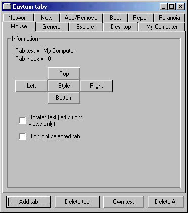



## Tab Control

### Description

Have a Tab control in your application with out having to have the huge OCX that microsoft provide. It's in the early stages yet but seems to work okay at the moment.
 
### More Info
 

             |
---                |---
**Submitted On**   |2000-09-30 18:21:46
**By**             |[Gary Eyles](https://github.com/Planet-Source-Code/PSCIndex/blob/master/ByAuthor/gary-eyles.md)
**Level**          |Advanced
**User Rating**    |5.0 (10 globes from 2 users)
**Compatibility**  |VB 6\.0
**Category**       |[Custom Controls/ Forms/  Menus](https://github.com/Planet-Source-Code/PSCIndex/blob/master/ByCategory/custom-controls-forms-menus__1-4.md)
**World**          |[Visual Basic](https://github.com/Planet-Source-Code/PSCIndex/blob/master/ByWorld/visual-basic.md)
**Archive File**   |[CODE\_UPLOAD103221012000\.zip](https://github.com/Planet-Source-Code/gary-eyles-tab-control__1-11803/archive/master.zip)

